# PominGL

#### Description
Computer Graphics and GIS Visualization, NNU, 2021 Fall
Group Member：Zhang Jingchi, Peng Qi and Yao Zezhong

#### Software Architecture
A system aped OpenGL and realized its major functions including raster images, clipping, vector file importing, transformation matrices, surface shading, texture mapping, ray tracing.

My job is to complete the functions of drawing and coloring lines, polylines, circle, triangle, rectangle and polygons; clipping lines, polylines, rectangles and polygons; finishing MVP(model, view, projection) transformation matrices, Z-BUFFER blanking algorithm, shading model such as LAMBERT model, PHONG model, BLINN-PHONG model. Software utilized: C/C++.

The system includes servals modulars, namely Geometric Modeling, Geometric Transformation, Color Mode Setting, Illumination Model Setting, Texture Mapping and Vector-Raster file management.

Besides, user can also use mouse and keyboard to rotate, move, scale the graphics; change the texture, color, view and light of the 3D cube.

The system' s  **menu bar** :
| Name              | Function                                                                                                                |
|-------------------|-------------------------------------------------------------------------------------------------------------------------|
| 文件(Files)         | Open and rasterize the vector map file and basic   functions such as open, close, exit                           |
| 2D图形(2D graphics) | basic 2D geometry drawing                                                                                               |
| 三维(3D graphics)   | Implement perspective projection , hidden surface, texture mapping and illumination settings for 3D cubes               |
| 设置(Setting)       | Set the size of the background pixels, implement grid mode, pixel mode and geometric drawing mode                       |
| 工具(Tools)         | Set the color fill function, the clear canvas function and the function to reset to the drawing on the original canvas. |
| 画笔颜色(Brush color) | Red, green and blue colors can be selected to achieve the drawing function                                              |
### System Demo
 **User Interface：** 

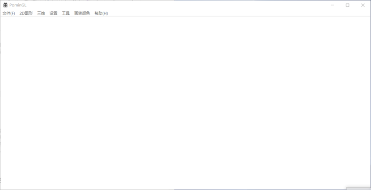

 **2D geometry drawing** 
- line

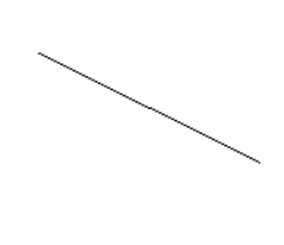
- polyline:

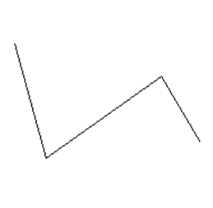
- circle

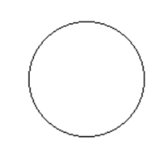
- ellipse

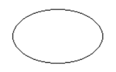
- polygon

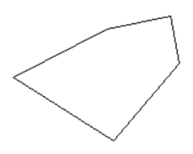
- triangle

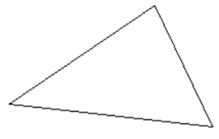
- filled polygon:

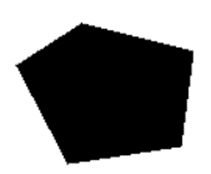
- filled triangle

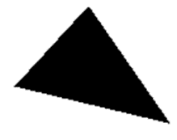

 **2D operation** 
- filling

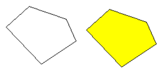

- clipping

Cohen Sutherland, MidPoint Algorithm
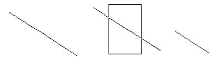

Sutherland Hodgeman
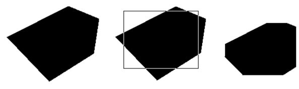

Weiler Atherton
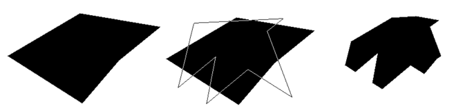

 **drawing mode** 
- pixel mode

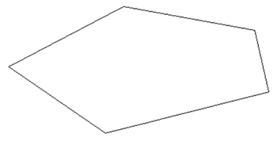
- grid mode

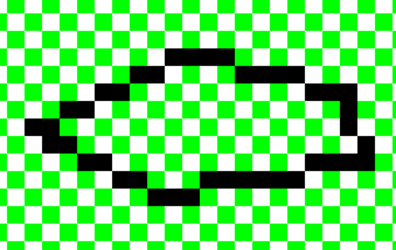

 **vector-raster file** 

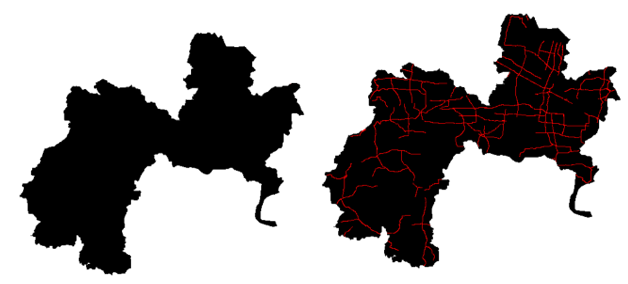

 **3D rendering** 

- 3D Cube model

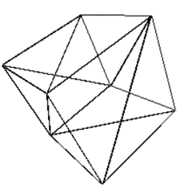

- hidden surface

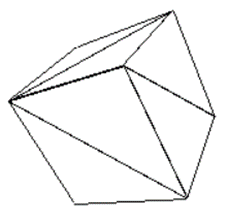

- color

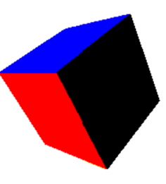

- illumination model

Lambert Lambert Model
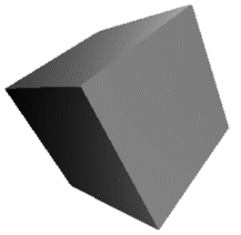

Gouraud Model
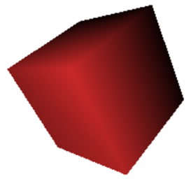

- Texture Mapping

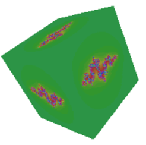
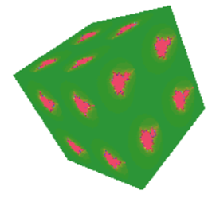

